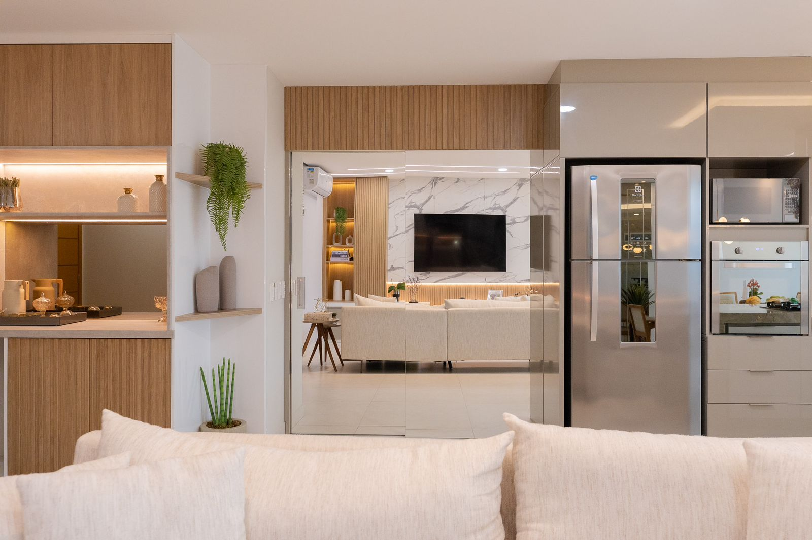
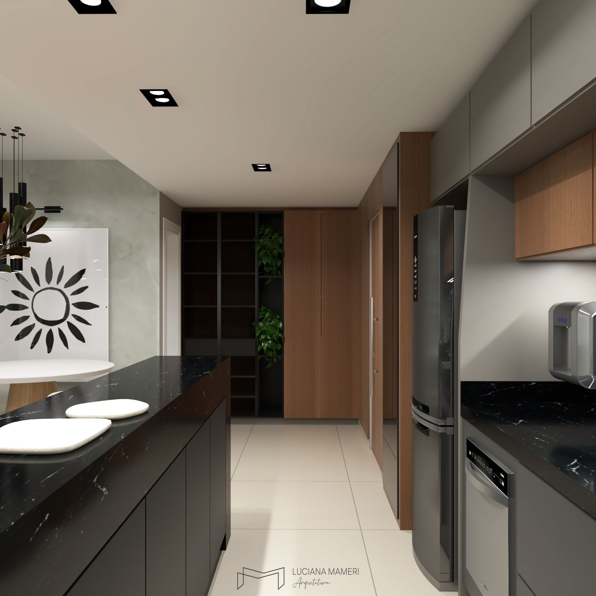
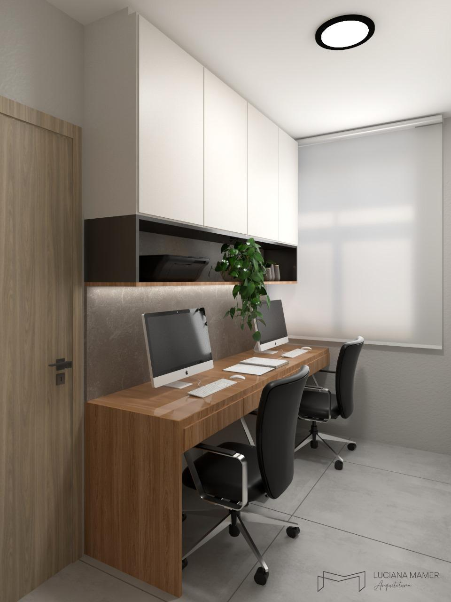

/*******GALERIA**************/

html 

<!-- galeria teste  -->
    

      

          
          

              <h3>Title 1</h3>
              
Short description 1

          

      

      

          
          

              <h3>Title 1</h3>
              
Short description 1

          

      

      

          
          

              <h3>Title 1</h3>
              
Short description 1

          

      

      

          
          

              <h3>Title 2</h3>
              
Short description 2

          

      

      

          
          

              <h3>Title 2</h3>
              
Short description 2

          

      

      

          
          

              <h3>Title 2</h3>
              
Short description 2

          

      

      <!-- Adicione mais itens da galeria conforme necessário -->
  

  css

  
/* <!-- galeria teste  --> */
.gallery {
    display: flex;
    flex-wrap: wrap;
    justify-content: center;
    gap: 10px;
    padding: 20px;
}

.gallery-item {
    position: relative;
    width: calc(33.333% - 20px); /* 3 items per row */
    margin-bottom: 20px;
    overflow: hidden;
}

.gallery-item img {
    width: 100%;
    height: auto;
    display: block;
    object-fit: cover;
    transition: transform 0.3s ease;
}

.gallery-item:hover img {
    filter: brightness(70%);
}

.overlay {
    position: absolute;
    top: 0;
    left: 0;
    right: 0;
    bottom: 0;
    background-color: rgba(0, 0, 0, 0.5);
    color: #fff;
    display: flex;
    flex-direction: column;
    justify-content: center;
    align-items: center;
    text-align: center;
    opacity: 0;
    transition: opacity 0.3s ease;
    padding: 20px;
}

.gallery-item:hover .overlay {
    opacity: 1;
}

/* Responsividade */
@media (max-width: 1024px) {
    .gallery-item {
        width: calc(50% - 20px); /* 2 items per row */
    }
}

@media (max-width: 768px) {
    .gallery-item {
        width: calc(100% - 20px); /* 1 item per row */
    }
}

html galeria 1********************

<!-- galeria1 -->
    

      

          

              
          

          <h3 class="title">Título 1</h3>
          
Descrição breve da imagem 1.

      

      

          

              
          

          <h3 class="title">Título 2</h3>
          
Descrição breve da imagem 2.

      

      

          

              
          

          <h3 class="title">Título 3</h3>
          
Descrição breve da imagem 3.

      

      

          

              
          

          <h3 class="title">Título 3</h3>
          
Descrição breve da imagem 3.

      

      

          

              
          

          <h3 class="title">Título 3</h3>
          
Descrição breve da imagem 3.

      

      

          

              
          

          <h3 class="title">Título 3</h3>
          
Descrição breve da imagem 3.

      

       Adicione mais itens conforme necessário
  

/* Estilo da galeria *******************************/
.gallery-container {
    display: flex;
    flex-wrap: wrap;
    justify-content: space-around;
    margin: 100px;
}

.gallery-item {
    margin: 10px;
    background-color: #f2f2f2;
    border-radius: 8px;
    overflow: hidden;
    text-align: center;
    flex-grow: 1;
}

.gallery-item.large {
    width: 60%;
}

.gallery-item.medium {
    width: 30%;
}

.gallery-item.small {
    width: 25%;
}

.image-wrapper {
    position: relative;
    width: 100%;
    padding-bottom: 100%;  /*Mantém a proporção quadrada  */
    overflow: hidden;
}

.image-wrapper img {
    position: absolute;
    top: 0;
    left: 0;
    width: 100%;
    height: 100%;
    object-fit: cover;
}

.title {
    margin: 15px 0 5px;
    font-size: 18px;
    color: #333;
}

.description {
    font-size: 14px;
    color: #666;
    margin-bottom: 15px;
}

@media (min-width: 768px) {
    .gallery-item.large {
        width: 45%;
    }
    
    .gallery-item.medium {
        width: 30%;
    }
    
    .gallery-item.small {
        width: 20%;
    }
}

@media (min-width: 1024px) {
    .gallery-item.large {
        width: 40%;
    }
    
    .gallery-item.medium {
        width: 25%;
    }
    
    .gallery-item.small {
        width: 15%;
    }
} 
/*******FIM GALERIA**************/

/**********Carrossel************/
.gallery {
    display: flex;
    justify-content: space-between;
    gap: 10px; /* Espaçamento entre os itens */
    flex-wrap: nowrap; /* Evita que as imagens quebrem para a linha seguinte */
}

.gallery-item {
    position: relative;
    width: 24%; /* Ajuste o percentual para criar o tamanho desejado */
    overflow: hidden;
}

.gallery-item img {
    width: 100%;
    height: calc(100% + 60%); /* Aumenta a altura das imagens */
    object-fit: cover;
    transition: transform 0.3s ease;
}

.gallery-item:hover img {
    transform: scale(1.05);
}

.overlay {
    position: absolute;
    bottom: 50%; /* Ajuste para centralizar melhor */
    left: 50%;
    transform: translateX(-50%);
    background: rgba(255, 255, 255, 0.6);
    width: 70%; /* Alargue o overlay se necessário */
    height: 80%; /* Ajuste a altura conforme desejado */
    display: flex;
    justify-content: center;
    align-items: center;
    transition: all 0.3s ease;
}

.title {
    font-size: 18px;
    font-weight: bold;
    color: #363636;
    text-decoration: none;
}

/* Media Queries para Responsividade */

/* Tablet */
@media (max-width: 1024px) {
    .gallery {
        flex-wrap: wrap; /* Permite que as imagens quebrem para a linha seguinte em telas menores */
    }

    .gallery-item {
        width: 48%; /* Duas colunas em telas menores */
    }
}

/* Mobile */
@media (max-width: 768px) {
    .gallery-item {
        width: 100%; /* Uma coluna em telas pequenas */
    }
    
    .overlay {
        height: 30%; /* Ajuste a altura do overlay para melhor visibilidade em dispositivos móveis */
    }

    .title {
        font-size: 16px; /* Reduza o tamanho da fonte em telas menores */
    }
}
